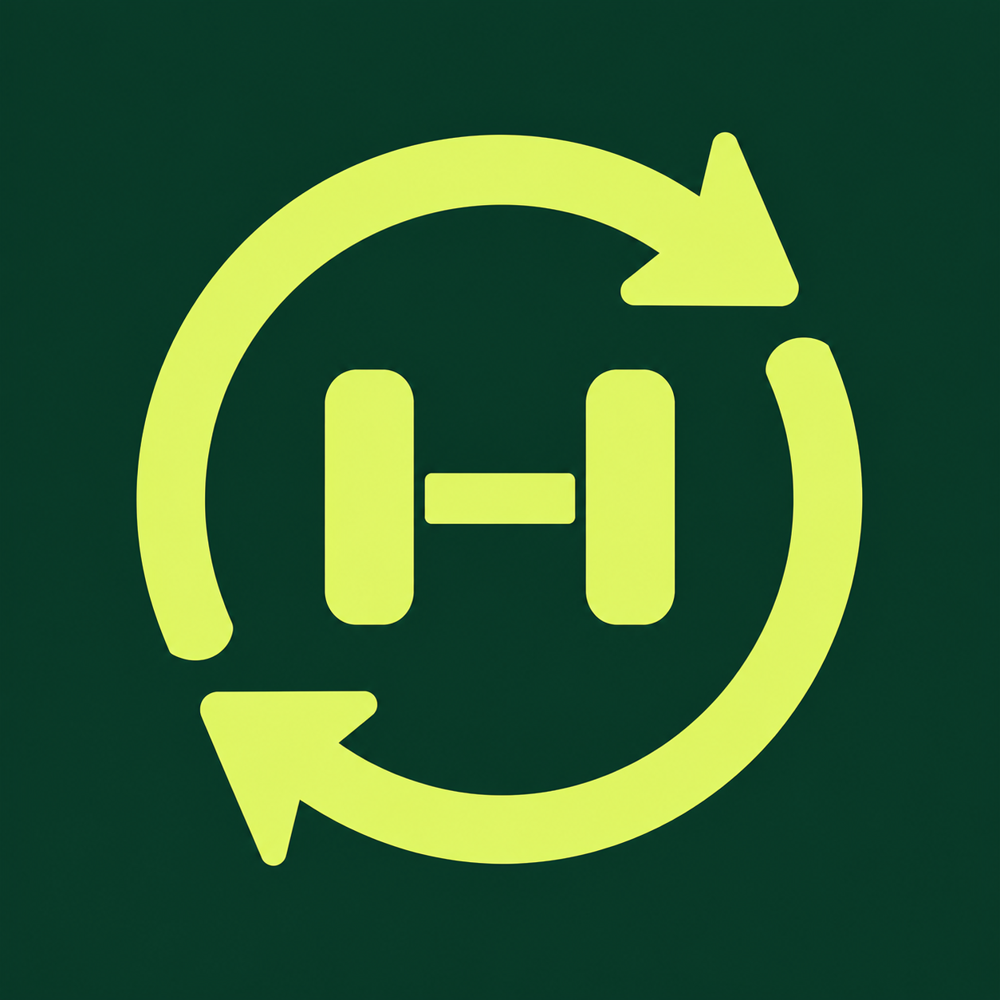
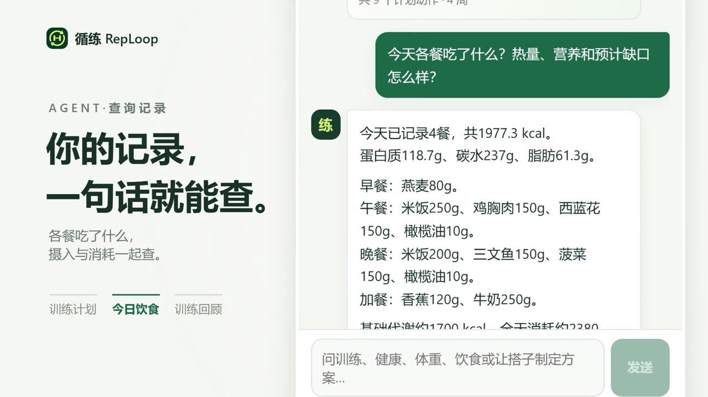
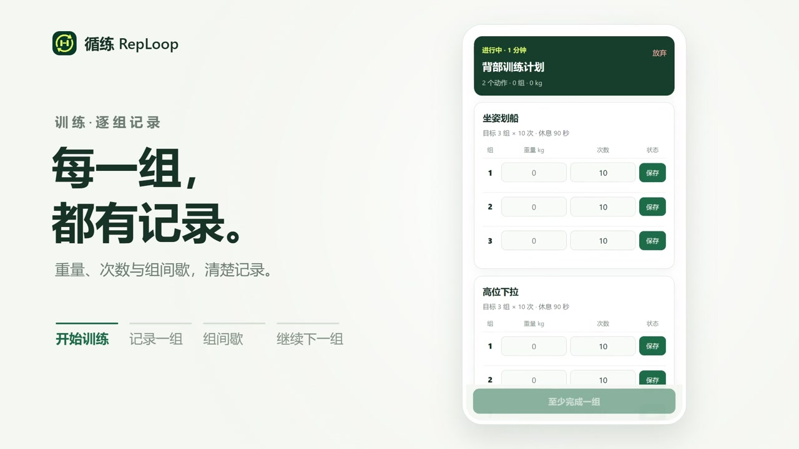
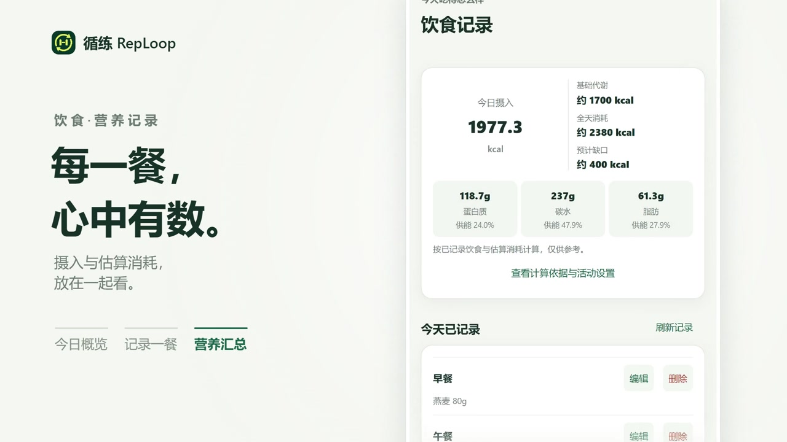
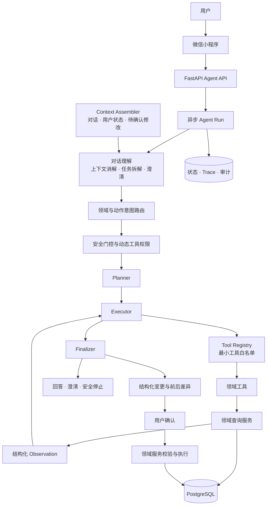

  

<h1 align="center">循练 RepLoop</h1>

<strong>记录训练与饮食，让健身助手更适合自己。</strong>

微信小程序 · 训练记录 · 饮食管理 · AI 健身助手

  <a href="#产品演示">观看演示</a> ·
  <a href="#申请体验">申请体验</a> ·
  <a href="docs/getting-started.md">自己运行</a> ·
  <a href="#参与改进">参与改进</a>

循练是一个从真实健身需求出发的个人健身助手：记录每组训练和每餐饮食，回顾身体变化，需要分析时直接向 Agent 提问。由 Agent 发起的数据修改，会先展示内容，由你确认后再执行。

你可以申请体验、提出建议，也可以借助 Codex，在循练的基础上开发和维护属于自己的健身助手。

## 产品演示

**点击下方播放器观看完整视频。**

https://github.com/user-attachments/assets/2991456d-62b9-459a-9490-8ae382509d74

[下载完整演示视频](https://github.com/ZeHleven/Fitness-Agent/raw/refs/heads/main/docs/assets/reploop-demo.mp4)

<table>
  <tr>
    <td width="50%"></td>
    <td width="50%"></td>
  </tr>
  <tr>
    <td align="center"><strong>每一组，都有记录。</strong></td>
    <td align="center"><strong>每一餐，心中有数。</strong></td>
  </tr>
</table>

视频与预览图来自使用示例数据的 H5 演示环境，展示产品流程；实际可用功能以当前体验版为准。Agent 演示回答使用固定示例，不代表实时模型输出。

## 申请体验

**循练目前提供微信小程序体验版，需要由作者先将你添加为体验成员。**

1. 在微信中搜索并关注公众号 **「循练RepLoop」**。
2. 在公众号对话框留言 **「申请体验」**，等待作者回复。这是人工处理的体验申请。
3. 按回复指引提供用于添加体验成员的微信账号。
4. 添加完成后，使用该微信账号，通过作者提供的体验入口打开小程序。

欢迎在体验后告诉我哪里不顺手、哪些功能对你有帮助，以及你希望怎样改进。体验申请和个人信息请通过私下联系渠道沟通，不要把微信号或健康记录贴到公开 Issue 中。

## 数据与隐私

- **数据保存在哪里：** 个人资料、训练与饮食记录、体重记录及 Agent 会话会保存到所连接的后端数据库，当前实现使用 PostgreSQL，并非只保存在手机中。体验版使用 Neon PostgreSQL，数据库位于 AWS 新加坡区域（2026-09-17 控制台确认）。自行部署时，由部署者管理数据存储与访问。
- **AI 会接收什么：** 使用 AI 功能时，你的问题、相关对话及完成任务所需的个人资料或训练、饮食等记录可能发送给配置的模型服务。项目默认对接 DeepSeek，具体服务以部署配置为准。
- **如何处理删除需求：** 当前尚未提供自助注销账号并一键清除全部数据的入口。退出登录只清除本机登录状态。体验版用户如需删除数据，请通过公众号「循练RepLoop」联系作者，确认身份核验与处理方式；自行部署的用户由自己的部署者处理。

更多说明见 [数据处理与隐私说明](docs/data-and-privacy.md)。

## 循练能帮你做什么

> 自行部署时，部分 Agent 修改功能及手动计划修改提案默认关闭，需要按[运行指南](docs/getting-started.md)启用；启用后仍需确认提案才能执行。体验版的可用功能以实际部署为准。

### 训练：记录表现，回顾进步

- 根据目标、经验、训练地点、可用时间和健康情况生成计划，预览并调整后保存。
- 查找动作，安排训练日、组数、次数、休息时间与建议重量。
- 按组记录训练表现，带入上次记录，查看个人最佳。
- 组间休息计时，训练结束后留下难度、精力和身体感受。
- 查看训练历史、趋势和下一练调整提案，确认后再应用变更。

### 饮食：把每餐记录放在一起

- 查询食物，按实际摄入量记录早、中、晚餐和加餐。
- 汇总每日热量、蛋白质、碳水和脂肪，辅助了解摄入情况。
- 查看和纠正历史饮食记录。
- 结合目标与训练情况生成可审阅的饮食方案，由你确认后保存。

### Agent：结合你的记录，一起分析和调整

- 用自然语言查询计划、下一练、训练进度、饮食与个人数据。
- 理解多轮对话中的指代和补充信息，必要时继续澄清。
- 协助修改计划、个人资料、体重与饮食，先展示修改内容，确认后才执行。
- 保留会话，支持查询耗时任务的运行状态和结果。

### 个人资料：为调整提供依据

管理训练目标、经验、地点和偏好，记录体重变化以及需要关注的健康限制，让计划与建议有据可依。

## 为什么做循练

最初做循练，是因为我在健身时需要带着本子和笔，记录动作、次数、组数、组间休息和感受。换一个器械，本子也要跟着搬，有时还会忘记拿。

饮食记录同样零散：查食物热量和三大营养素、用计算器计算，再把身体信息、训练记录和饮食情况重新整理给 AI 分析。

我希望把这些事情集中起来，让记录更方便，让调整有依据。自己用上以后，我又有了一个想法：每个人的训练习惯都不一样，大家也应该有机会做出适合自己的健身助手。

我希望它成为一个可以接着创造的起点：直接使用、提出建议，或修改成自己的版本，都是很好的参与方式。

## 打造自己的健身助手

从一个具体需求开始：简化记录步骤、调整页面的信息顺序，或改变组间休息的交互。借助 Codex 时，可以这样描述：

> 请先阅读 README 和小程序说明，找到组间休息倒计时的实现。我希望增加一个「+15 秒」按钮，保留现有「+30 秒」和跳过功能。请说明准备修改的位置，完成修改后运行相关检查，并告诉我如何在微信开发者工具中验证。

运行、修改、验证，再逐步扩展。自己的版本由自己维护；如果一个改进也能帮助其他人，欢迎通过 Pull Request 分享回来。

**开始开发：** [本地运行与配置指南](docs/getting-started.md)

自行部署需要自己的小程序身份、数据库与模型服务配置，并自行承担相应服务费用和维护工作。

## 参与改进

- **提出建议：** 在 [Issues](https://github.com/ZeHleven/Fitness-Agent/issues) 描述使用场景、遇到的问题和期待的体验。
- **报告问题：** 附上复现步骤、实际结果和必要的截图，移除个人信息与密钥。
- **贡献代码：** 欢迎提交范围清晰的改动；较大的功能可以先开 Issue 讨论。请说明改动解决了什么问题，以及怎样验证。
- **分享自己的版本：** 欢迎介绍你改变了什么，以及这些改变怎样帮助你训练。

只使用、偶尔反馈，或者参与开发，都欢迎。

## 技术与文档

| 部分 | 主要技术 |
| --- | --- |
| 微信小程序 | Taro、React、TypeScript |
| 后端 API | Python、FastAPI |
| Agent | LangChain、DeepSeek、领域工具与待确认提案 |
| 数据与运行环境 | PostgreSQL、Redis、Docker Compose |
| 体验版部署 | 微信云托管 |

- [本地运行与配置](docs/getting-started.md)
- [微信小程序说明](miniapp/README.md)
- [Agent 设计与实现](docs/agent/README.md)
- [云托管部署包说明](deploy/cloudbase/README.md)
- [数据处理与隐私说明](docs/data-and-privacy.md)
- [安全问题反馈](SECURITY.md)
- [展示素材说明](docs/assets/README.md)

展开查看 Agent 的运行机制与架构

## Agent 设计

循练 RepLoop 不把数据库或无限制工具直接交给模型。模型负责理解目标、规划步骤和生成结构化变更，服务端负责工具权限、健康安全、数据校验和最终执行。

<table>
  <tr>
    <td width="50%" valign="top">
      <h3>🧠 对话理解与意图路由</h3>
      <ul>
        <li>处理多轮上下文、指代消解、任务拆解和缺失信息澄清</li>
        <li>分别识别训练、档案、健康、体重、饮食等领域，以及查询、评估、创建、修改和删除等动作</li>
        <li>模型输出必须通过结构化协议与服务端语义校验</li>
      </ul>
    </td>
    <td width="50%" valign="top">
      <h3>🧭 Plan-and-Execute 运行时</h3>
      <ul>
        <li>将复杂请求拆解为有限、可审计的执行步骤</li>
        <li>根据工具结果动态决定继续查询、重新规划、澄清或结束</li>
        <li>Controller 约束步骤数量、工具权限、调用预算和停止条件</li>
      </ul>
    </td>
  </tr>
  <tr>
    <td width="50%" valign="top">
      <h3>🧰 Tool Registry 与最小权限</h3>
      <ul>
        <li>统一注册训练、档案、健康、体重和饮食领域工具</li>
        <li>每轮根据意图生成最小工具白名单，未知工具和越权调用默认拒绝</li>
        <li>业务事实始终由领域工具从服务端读取，避免模型臆测用户数据</li>
        <li>Evidence Coordinator 校验并补齐任务所需证据，限制无关敏感数据读取</li>
      </ul>
    </td>
    <td width="50%" valign="top">
      <h3>🧩 上下文、状态与恢复</h3>
      <ul>
        <li>按需装配最近对话、用户状态、澄清状态和待确认修改</li>
        <li>同一会话串行执行，避免并发消息污染上下文</li>
        <li>支持异步 Agent Run、轮询、请求幂等与失败恢复</li>
      </ul>
    </td>
  </tr>
  <tr>
    <td width="50%" valign="top">
      <h3>✅ 可确认的受控写入</h3>
      <ul>
        <li>模型只生成结构化变更，不直接写入数据库</li>
        <li>服务端生成前后差异，并校验数据范围、资源归属和当前版本</li>
        <li>用户确认后才由领域服务执行；过期、冲突或健康条件变化都会阻止写入</li>
      </ul>
    </td>
    <td width="50%" valign="top">
      <h3>🛡️ 安全与可观测性</h3>
      <ul>
        <li>健康风险在意图输入、工具调用和最终输出阶段持续拦截</li>
        <li>执行轨迹记录意图、规划、工具调用、观察结果和终止原因</li>
        <li>通过确定性评测、集成测试和 CI 验证 Agent 行为边界</li>
      </ul>
    </td>
  </tr>
</table>

### Agent 运行架构

## 技术栈

- **Agent 与后端**：Python 3.13、FastAPI、LangChain、DeepSeek、PostgreSQL、Alembic
- **小程序客户端**：Taro、React、TypeScript、微信小程序
- **工程保障**：Pydantic 结构化协议、异步任务、数据库事务、自动化评测与 CI

完整设计文档见 [docs/agent](docs/agent/README.md)。

> 本项目用于 Agent 架构与健身产品工程实践，不提供医疗诊断或治疗。

## 开源许可

本项目的原创代码与文档采用 [MIT 许可证](LICENSE)。欢迎使用、修改、分享，也允许商业使用；分发时需保留原版权声明和许可证。修改后的版本可以使用其他许可或闭源发布，无需公开源码。

第三方依赖和素材遵循各自的许可证。仓库中的演示视频已移除音轨，详见[展示素材说明](docs/assets/README.md)。

---

**循序渐进，练出自己的节奏。**
