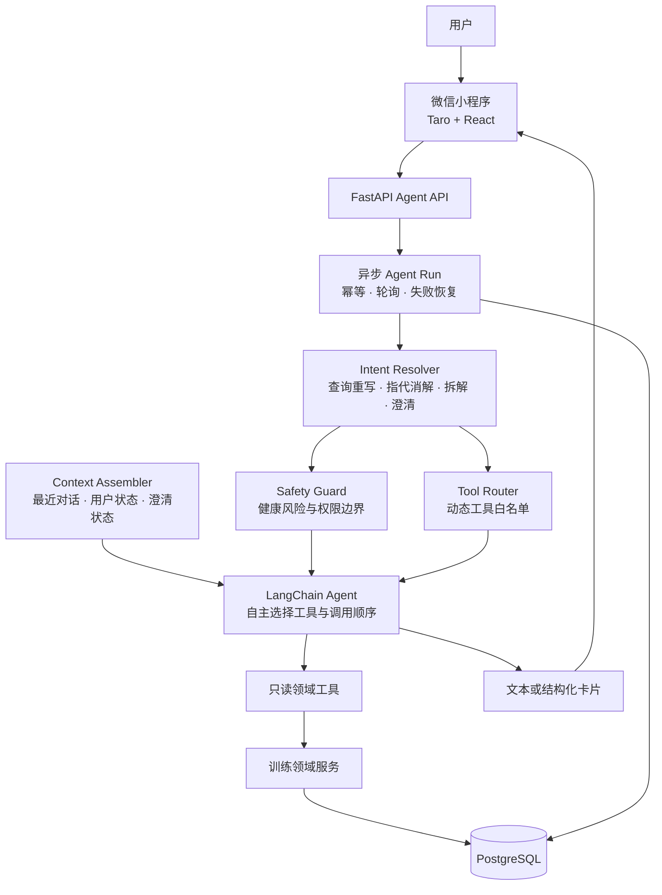

# Fitness Agent

## 简介

Fitness Agent 是一个以微信小程序为入口的运动健康Agent，能够理解多轮上下文，并基于用户资料、训练计划和历史数据动态调用工具，提供个性化训练建议、饮食建议与调整提案。

## ✨ 核心特性

<table>
  <tr>
    <td width="50%" valign="top">
      <h3>🧠 理解与规划</h3>
      <ul>
        <li><strong>多轮语境理解</strong>：意图拓展、指代消解、任务拆解与缺失信息澄清</li>
        <li><strong>多步任务规划与动态决策</strong>：按需拆解复合需求，并依据工具结果动态执行、并行查询或有限重规划</li>
        <li><strong>安全终止</strong>：根据证据输出回答、澄清、安全停止或待确认提案</li>
      </ul>
    </td>
    <td width="50%" valign="top">
      <h3>🧰 Tool Calling</h3>
      <ul>
        <li><strong>动态工具路由</strong>：根据当前意图生成最小工具白名单</li>
        <li><strong>自主调用</strong>：在白名单内决定工具、调用顺序与停止时机</li>
        <li><strong>领域事实</strong>：用户资料、训练计划和历史数据均由服务端工具提供</li>
      </ul>
    </td>
  </tr>
  <tr>
    <td width="50%" valign="top">
      <h3>🧩 状态与上下文</h3>
      <ul>
        <li><strong>分层装配</strong>：按需组合最近对话、用户状态与澄清状态</li>
        <li><strong>会话隔离</strong>：同一会话串行执行，避免并发消息污染上下文</li>
        <li><strong>异步恢复</strong>：支持后台 Run、轮询、请求幂等与失败恢复</li>
      </ul>
    </td>
    <td width="50%" valign="top">
      <h3>🛡️ 安全与可靠性</h3>
      <ul>
        <li><strong>健康安全</strong>：优先拦截高风险症状，不替代医疗诊断</li>
        <li><strong>只读优先</strong>：默认开放查询与提案，写操作保持关闭</li>
        <li><strong>可观测评测</strong>：提供执行轨迹、工具审计、自动化测试与 CI</li>
      </ul>
    </td>
  </tr>
</table>

## 架构

主要技术栈：Python 3.13、FastAPI、LangChain、DeepSeek、PostgreSQL、Taro、React、TypeScript。

完整设计文档见 [docs/agent](docs/agent/README.md)。

> 本项目用于 Agent 架构与健身产品工程实践，不提供医疗诊断或治疗。
