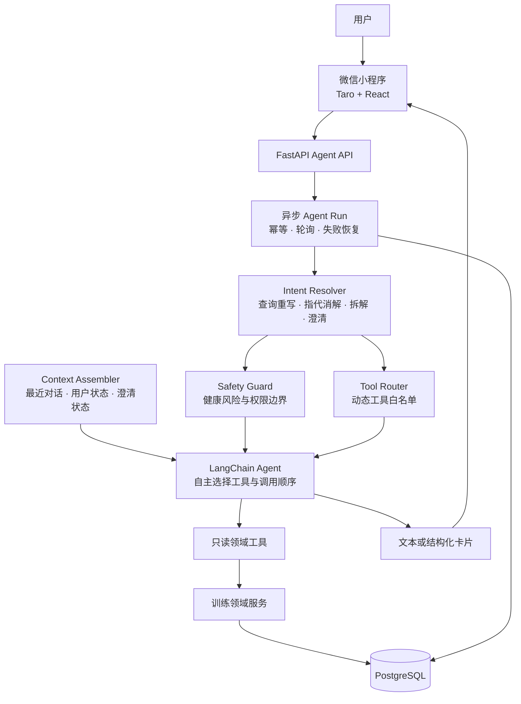

# Fitness Agent

## 简介

Fitness Agent 是一个以微信小程序为入口的运动健康Agent，能够理解多轮上下文，并基于用户资料、训练计划和历史数据动态调用工具，提供个性化训练建议、饮食建议与调整提案。

## 架构

核心设计：

- **Intent Resolver** 负责意图拓展、指代消解、任务拆解和缺失信息澄清。
- **Tool Router** 根据当前意图生成最小工具白名单，不把固定场景绑定成固定流程。
- **LangChain Agent** 在白名单内自主决定是否调用工具、调用顺序以及何时停止。
- **领域服务** 是训练数据的唯一事实来源，模型不能直接访问数据库。
- **Safety Guard** 在模型调用前阻断健康高风险请求和未开放的写操作。
- **异步运行协议** 负责请求幂等、任务恢复和同一会话串行执行。

主要技术栈：Python 3.13、FastAPI、LangChain、DeepSeek、PostgreSQL、Taro、React、TypeScript。

完整设计文档见 [docs/agent](docs/agent/README.md)。

> 本项目用于 Agent 架构与健身产品工程实践，不提供医疗诊断或治疗。
