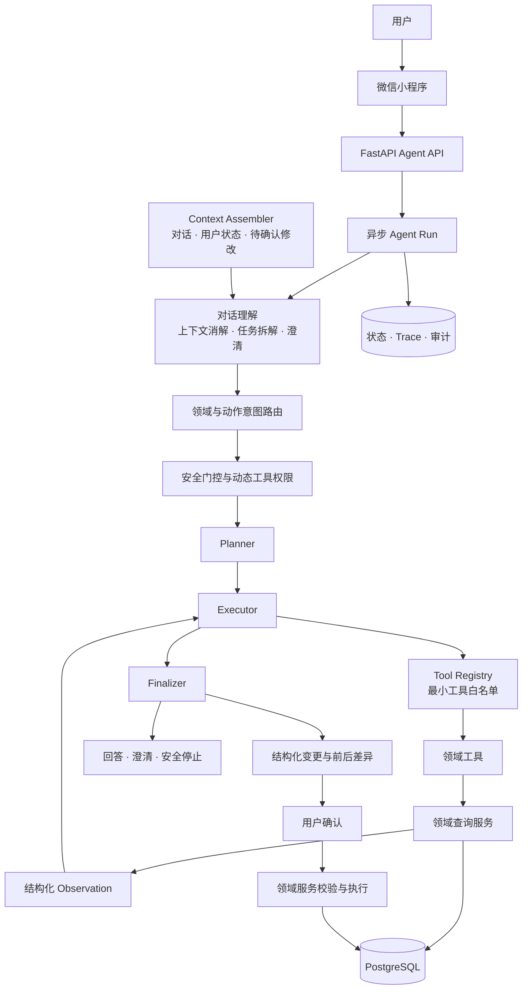

# Fitness Agent

## 简介

Fitness Agent 是一个以微信小程序为入口的运动健康 Agent。它不仅能理解多轮对话并查询用户的训练与健康数据，还能协助管理训练计划、个人档案、体重和饮食；由 Agent 发起的修改都会先展示给用户确认，再由服务端安全执行。

> **🚀 v0.5.24 最新更新**：产品从训练问答助手升级为覆盖训练、健康、体重和饮食的可操作健身助手，新增四栏主导航、完整训练计划编辑、健康变化自动复核，以及多领域 Agent 受控写入。

## 产品能力

<table>
  <tr>
    <td width="50%" valign="top">
      <h3>🤖 AI 训练搭子</h3>
      <ul>
        <li>用自然语言查询训练计划、下一练、训练记录、进度、健康和饮食数据</li>
        <li>理解多轮对话中的指代、省略、补充信息和混合请求</li>
        <li>协助调整计划、档案、体重和饮食，由 Agent 发起的修改确认后才会生效</li>
      </ul>
    </td>
    <td width="50%" valign="top">
      <h3>🏋️ 训练全流程管理</h3>
      <ul>
        <li>根据目标、经验、地点、时间和健康情况生成个性化训练计划</li>
        <li>调整计划周期、训练日、动作、组数、次数、休息时间和建议重量</li>
        <li>记录每组表现、休息倒计时、训练反馈、历史趋势和个人最佳</li>
        <li>健康资料变化后自动复核计划，并阻止开始不安全的训练</li>
      </ul>
    </td>
  </tr>
  <tr>
    <td width="50%" valign="top">
      <h3>❤️ 个人与健康管理</h3>
      <ul>
        <li>管理基础资料、训练目标、经验、地点和训练偏好</li>
        <li>记录伤病、慢性情况和饮食限制</li>
        <li>查看 BMI、当前体重和体重变化历史</li>
      </ul>
    </td>
    <td width="50%" valign="top">
      <h3>🥗 饮食与营养管理</h3>
      <ul>
        <li>搜索食品并按实际克数记录早、中、晚餐和加餐</li>
        <li>自动汇总今日热量、蛋白质、碳水和脂肪</li>
        <li>查看近 30 天饮食历史，并删除错误记录</li>
      </ul>
    </td>
  </tr>
</table>

## Agent 设计

Fitness Agent 不把数据库或无限制工具直接交给模型。模型负责理解目标、规划步骤和生成结构化变更，服务端负责工具权限、健康安全、数据校验和最终执行。

<table>
  <tr>
    <td width="50%" valign="top">
      <h3>🧠 对话理解与意图路由</h3>
      <ul>
        <li>处理多轮上下文、指代消解、任务拆解和缺失信息澄清</li>
        <li>分别识别训练、档案、健康、体重、饮食等领域，以及查询、评估、创建、修改和删除等动作</li>
        <li>模型输出必须通过结构化协议与服务端语义校验</li>
      </ul>
    </td>
    <td width="50%" valign="top">
      <h3>🧭 Plan-and-Execute 运行时</h3>
      <ul>
        <li>将复杂请求拆解为有限、可审计的执行步骤</li>
        <li>根据工具结果动态决定继续查询、重新规划、澄清或结束</li>
        <li>Controller 约束步骤数量、工具权限、调用预算和停止条件</li>
      </ul>
    </td>
  </tr>
  <tr>
    <td width="50%" valign="top">
      <h3>🧰 Tool Registry 与最小权限</h3>
      <ul>
        <li>统一注册训练、档案、健康、体重和饮食领域工具</li>
        <li>每轮根据意图生成最小工具白名单，未知工具和越权调用默认拒绝</li>
        <li>业务事实始终由领域工具从服务端读取，避免模型臆测用户数据</li>
      </ul>
    </td>
    <td width="50%" valign="top">
      <h3>🧩 上下文、状态与恢复</h3>
      <ul>
        <li>按需装配最近对话、用户状态、澄清状态和待确认修改</li>
        <li>同一会话串行执行，避免并发消息污染上下文</li>
        <li>支持异步 Agent Run、轮询、请求幂等与失败恢复</li>
      </ul>
    </td>
  </tr>
  <tr>
    <td width="50%" valign="top">
      <h3>✅ 可确认的受控写入</h3>
      <ul>
        <li>模型只生成结构化变更，不直接写入数据库</li>
        <li>服务端生成前后差异，并校验数据范围、资源归属和当前版本</li>
        <li>用户确认后才由领域服务执行；过期、冲突或健康条件变化都会阻止写入</li>
      </ul>
    </td>
    <td width="50%" valign="top">
      <h3>🛡️ 安全与可观测性</h3>
      <ul>
        <li>健康风险在意图输入、工具调用和最终输出阶段持续拦截</li>
        <li>执行轨迹记录意图、规划、工具调用、观察结果和终止原因</li>
        <li>通过确定性评测、集成测试和 CI 验证 Agent 行为边界</li>
      </ul>
    </td>
  </tr>
</table>

### Agent 运行架构

## 技术栈

- **Agent 与后端**：Python 3.13、FastAPI、LangChain、DeepSeek、PostgreSQL、Alembic
- **小程序客户端**：Taro、React、TypeScript、微信小程序
- **工程保障**：Pydantic 结构化协议、异步任务、数据库事务、自动化评测与 CI

完整设计文档见 [docs/agent](docs/agent/README.md)。

> 本项目用于 Agent 架构与健身产品工程实践，不提供医疗诊断或治疗。
